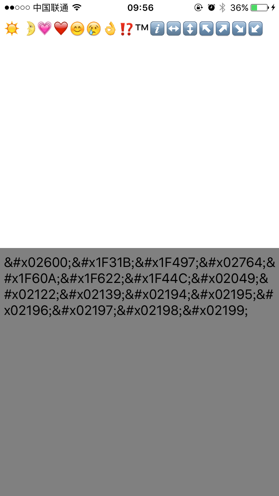

# Emoji
emoji表情转换方案

 移动端和PC端表情兼容方案

## Emoji最终效果
-------------------
* 调用NSString+TYHEmoji分类；
* //&#x1f602 ----->\U0001F604  - (NSString *)stringByReplacingEmojiCheatCodesToUnicode
* //\U0001F604 -----> &#x1F602 - (NSString *)stringByReplacingEmojiUnicodeToCheatCodes

如下图所示：

