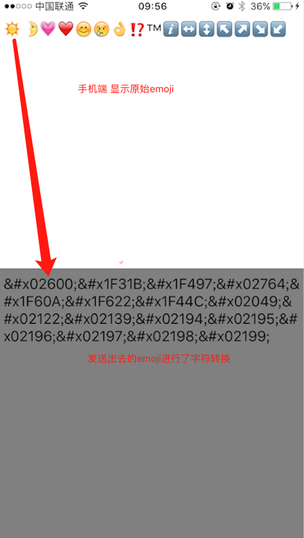

# Emoji
emoji表情转换方案

 移动端和PC端表情兼容方案
    PC端：由于没有表情库，故手机端发送表情标示 （如&#x1f602）到服务器，服务器给PC端，PC接收到的字段都是&#x类，然后通过对应关系就可以知道是哪个表情，再通过网络下载图片显示在界面。PC端发送表情时候，也是先转换为&#x1f602标示，手机端接收到之后根据这个NSstring分类进行转换为\U000类型。
详情请见：emoji表情兼容处理说明.doc 文档
## Emoji最终效果
-------------------
* 调用NSString+TYHEmoji分类；
* //&#x1f602 ----->\U0001F604  - (NSString *)stringByReplacingEmojiCheatCodesToUnicode
* //\U0001F604 -----> &#x1F602 - (NSString *)stringByReplacingEmojiUnicodeToCheatCodes

如下图所示：

<!---->

